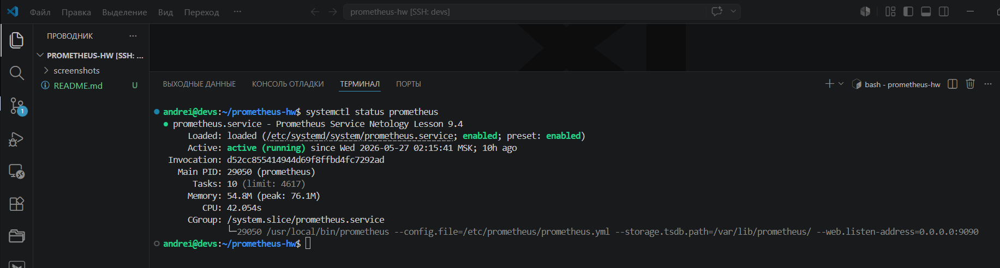
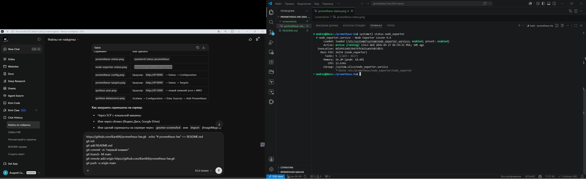
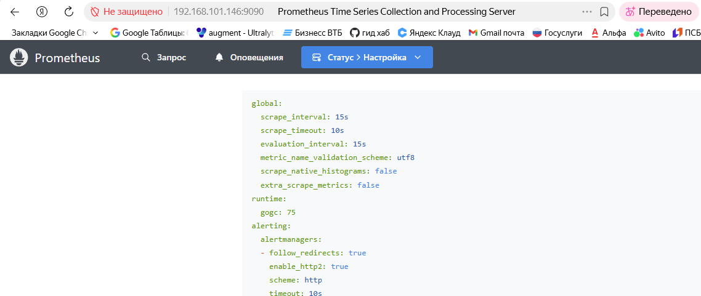
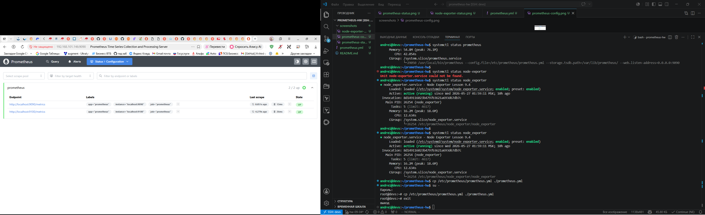
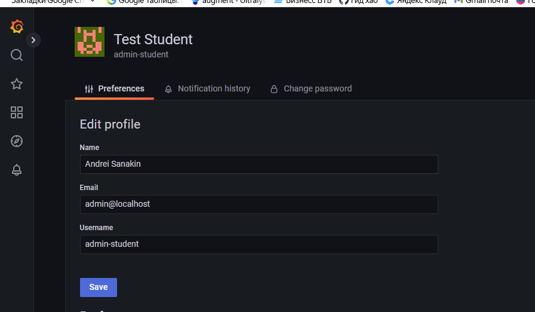
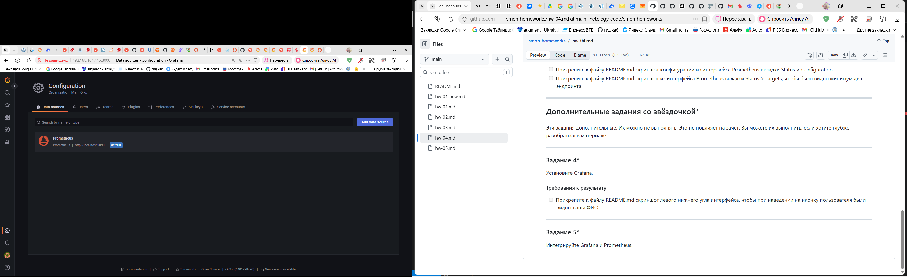

# Домашнее задание к занятию «Система мониторинга Prometheus»
# Санакин Андрей

## Задание 1. Установка Prometheus

Скриншот: `systemctl status prometheus`

## Задание 2. Установка Node Exporter

Скриншот: `systemctl status node-exporter`

## Задание 3. Подключение Node Exporter к Prometheus

Скриншот: Status &gt; Configuration

Скриншот: Status &gt; Targets

## Задание 4*. Установка Grafana

Скриншот: левый нижний угол с ФИО

## Задание 5*. Интеграция Grafana и Prometheus

Скриншот: подключение Prometheus как data source

